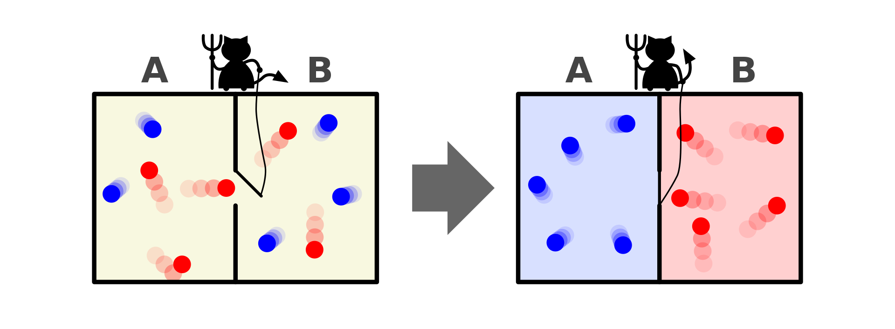
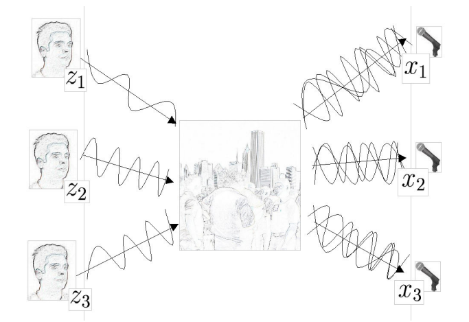
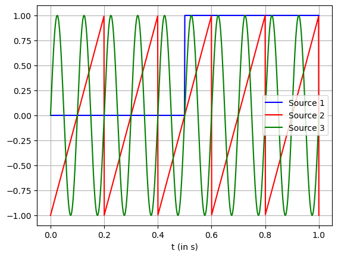
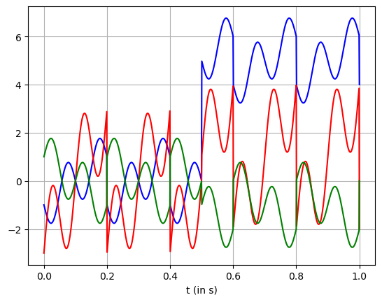
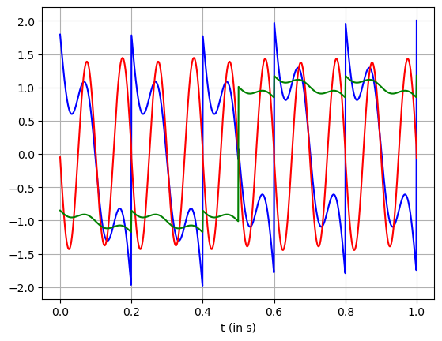

<script type="text/x-mathjax-config">
    MathJax.Hub.Config({
        tex2jax: {
        skipTags: ['script', 'noscript', 'style', 'textarea', 'pre'],
        inlineMath: [['$','$']]
        }
    });
    </script>
      
<script type="text/javascript" async src="https://cdn.mathjax.org/mathjax/latest/MathJax.js?config=TeX-MML-AM_CHTML"> </script>

***

# Entropy and Independent Component Analysis

**Blind source separation using complex system framework**

*Posted on November 2023*

***

This journal is originally two articles that I published back in 2020 on a certain blogging platform. One was talking about independent component analysis and the other was talking about independence and uncorrelatedness. However, due to the removal of said account, I plan to combine, add, and revise the articles as I think it is quite a good journal for me.

## Entropy

I am sure almost every informed or geek person has, at some point, encountered entropy. The pop culture conception of entropy is usually built around time, that the entropy is the arrow of time. At least that was the first time I heard of entropy back in highschool. If I remember, it was a YouTube video of Brian Greene talking about quantum physics. That encounter took a part of the reason for me pursuing physics.

Entropy was first introduced by Rudolph Clausius in 1865. He defined Entropy as energy that can not be transferred to work and thus dissipated as heat. Then comes around Maxwell in 1871 with his demon. He proposed a hypothetical system of a box that contain many particles. These particles are classified into two categories, one with bigger and faster particles and the other smaller and slow particles.



Image Source: https://en.wikipedia.org/wiki/Maxwell%27s_demon

However, a demon is introduced to operate a sort of wall or membrane that separate the box into two containers. The demon has certain rule, it would let the smaller particle to get pass through from the right container to the left container but not vice versa. The demon is also letting the bigger particle to pass through from left to right container but not vice versa. Maxwell then argues that in this kind system, there is no dissipated heat. Thus no entropy present eventhough the system does work. Which at that time a shocking proposal because according to the second law of thermodynamics, in a close system, entropy always increase.

## Boltzmann-Gibbs Entropy

It was Boltzmann and Gibbs that introduced entropy as a macroscropical properties that arises from a group of microscopical system. A system is a group of individual entities which have their own function that form a more complex entity that also have its function. A system has states that tells the behavior of the system, an example of states could be the temperature of a tank that contained liquid. The system is the tank, and the molecules in the tank are its individual entities. A group of system can interact with each other and in turn create a more complex system. This complex system also has states, which using the standpoint of its parts, is called macrostates. Using the same standpoint, the states of the parts are called microstates. Entropy is defined as the number of microstates which constitute to the macrostate.


$$S = k \;log \:W$$

With $S$ as entropy, $k$ as the Boltzmann's constant and $W$ as the thermodynamic probability. This Therimodynamic probability represent the microstates that correspond to the macrostate.

What after is the triumph of statistical mechanics. Here we are introduced to the first idea that a group of system when communicating with each other can create emergent system which behavior can be described using a parameter, in this case entropy.

## Shannon Entropy

Claude Shannon brought this concept of entropy to information theory. If we have the velocity of the particles as the microstates and temperature as the macrostate in thermodynamics, then in information theory, entropy can be thought of a macrostate of an information process. The events of the process are the microstates of this system. Entropy, when thought in this way, represents the uncertainty of the an information process.

$$H(X) = - \sum p(x)\log p(x)$$

Which is the general case of Boltzmann-Gibss entropy. The logarithmic of the above equation if it is in based 2 is defined as a bit, which defined the size of computer storage in todays world.

## Entropy and Independence, negative entropy

So we know that probability density functions have entropy. Entropy of a variable's probability density function represent the uncertainty of the variable. The flatter the density, the bigger the uncertainty of that particular variable. Using this principle, we can use entropy as a measure of non-gaussianity for a probability density function. Non-gaussianity is just a parameter to represent how close a vaiable's probability density function is to gaussian density.

Why is this important? Because gaussianity and non-gaussianity relate to independence. Central limit theorem states that the distribution of the sum of independent variables tend to be gaussian. By using this assumption, we can transform the mixture variables (from the sum of independent variables) to another set of variables in which their non-gaussianity is maximum.

There are many estimators of non-gaussianity, one of which is negative entropy or negentropy (people also call it reverse entropy). Its turns out, gaussian variable has the largest entropy among all random variables of equal variance. Hence, entropy can be used to estimate non-gaussianity.

$$J(X) = H(X_g) - H(X)$$

with $J$ as negenttropy, $X_g$ is the entropy of the gaussian variable with the same variance as $X$. When our independent variable is gaussian, then the negentropy would be 0. Because $H(X)$ will approach $H(X_g)$.

## Blind Source Separation

The introduction of negentropy as a meassure of independence led to a powerfull tool called independent component analysis, ICA in short. This tool developed to as a solution in blind source separation problem.

Imagine a room. In said room, there are three people talking and three microphones. Blind source separation is a problem in which we try to reconstruct the original signal from the recordings of the three people talking at the same time.

It can be ilustrated as below



Image Source: https://www.mit.edu/~gari/teaching/6.555/LECTURE_NOTES/ch15_bss.pdf

Mathematically, blind source separation can be modelled as

$$X = A \;S$$

With $S$ as the sources, $X$ as the measured signals, and $A$ as the mixing matrix. By estimating $A$ as $W$, we could obtain the original signals $S$ as

$$S= W \; X$$

Then the problem becomes to find $W$ in which maximize the non-gaussianity of $WX$.

## Practical independent component analysis using python (SKlearn)

SKlearn already have a function that perform ICA called FastICA. FastICA is one of many methods to perform ICA. The derivation of FastICA is a bit long and would require the knowledge of maximum entropy principle. So, I will not talk about it here. However, what I can do is demonstrating a simple ICA in SKlearn.


```python
import matplotlib.pyplot as plt
import numpy as np
from scipy import signal
from sklearn.decomposition import FastICA
```

Create the sources for the signals. Here, the first signal is a step function with amplitude of 1. The second source is a sawtooth signal. And the last source is a sinusoidal signal.


```python
# timestamp
t = np.linspace(0, 1, 1000)

# first source
a1 = 1
s1 = np.heaviside(t-0.5, 0.5)

# second source
s2 = signal.sawtooth(2 * np.pi * 5 * t)

# third source
a3 = 1
f3 = 10
s3 = a3*np.sin(2*np.pi*f3*t)
```

The graph models are given below


```python
plt.plot(t, s1, '-b', label="Source 1")
plt.plot(t, s2, '-r', label="Source 2")
plt.plot(t, s3, '-g', label="Source 3")
plt.xlabel(r't (in s)')
plt.grid()
plt.legend()
```


    <matplotlib.legend.Legend at 0x1cd48034210>


    

    


Then, combine the sources to three signals. Pretend that this signals are what we meassured from the process. It could be electrical signal, position of objects, economics, etc.

To make it easy to understand independent component analysis, pretend this is an EEG signal of an activity. The problem is what the EEG meassure is the voltage difference on the scalp, not the actual source. Hence the need to separate this signal. It is reasonable to assume independency between the activity and other noises such as blinking, breathing, etc. Hence the use of ICA.


```python
x1 = 5*s1 + s2 - s3
x2 = s1 + 3*s2 + 2*s3
x3 = -s1 - s2 + s3
```

This is what we meassured in EEG


```python
plt.plot(t, x1, '-b')
plt.plot(t, x2, '-r')
plt.plot(t, x3, '-g')

plt.xlabel(r't (in s)')
plt.grid()
```


    

    


Transform using ICA


```python
X = np.transpose(np.array([x1, x2, x3]))
transformer = FastICA(n_components=3, whiten='unit-variance')
X_transformed = transformer.fit_transform(X)
```

The result of ICA would be


```python
plt.plot(t, X_transformed[:,0], '-b')
plt.plot(t, X_transformed[:,1], '-r')
plt.plot(t, X_transformed[:,2], '-g')
plt.xlabel(r't (in s)')
plt.grid()
```


    

    


Though it is not perfect, we can see that the three signals almost made up of a step signal, a sawtooth signal, and a sinusoidal signal.

## Conclusion and further discussion

The biggest take away for me is how we can treat information as a problem of complex system and comes up with property such as entropy to define uncertainty. And as we know, entropy allows us to analyze the world through different kind methods such as independent component analysis. There are several theories that states negentropy or negative entropy as an emergence behavior that makes the system less chaotic. It is as if the complex system tries to fight the second law of thermodynamics.

In anycas, entropy might only be one of many possible properties of emergence behavior. Maybe there are more out there and we just looking it at different perspective.

## References:

- A. Hyvarinen, E. Oja. *Independent component analysis: algorithms and applications*. 2000. https://www.cse.msu.edu/~cse902/S03/icasurvey.pdf

- A. Hyvarinen. *New Approximations of Differential Entropy for Independent Component Analysis and Projection Pursuit*. https://www.cs.helsinki.fi/u/ahyvarin/papers/NIPS97.pdf

## Appendix: comparison with PCA, correlation vs dependence

A lot of people have difficulties to differentiate principal component analysis (PCA) and ICA. PCA is a machine learning algorithm that can transform a data set through the maximization of uncorrelated-ness. In contrast, ICA transforms the data using the maximization of independence.

By definition, two variables are said to be correlated if there is a pattern between the two’s trend. For example, a set of data shows that an increase in city's vehicle density coupled with an increase in its air pollution. This could be an indication that there is a positive correlation between vehicle density and air pollution.

In mathematical terms, correlation can be quantified using the correlation coefficient ($\rho$). It is a property to show how similar two or more variables are. It is defined as

$$\rho(x, y) = \frac{cov(x,y)}{\sqrt{var(x) \cdot var(y)}}$$

$var(x)$ and $var(y)$ are both the variance of $x$ and $y$. The term $cov(x,y)$ is the covariance between $x$ and $y$. Covariance is a property that shows how 'far' one variable to the other. Two variables are called uncorrelated if their correlation coefficient is zero. It also trues when their covariance is zero. Mathematically

$$cov(x,y)=E\{xy\}-E\{x\}E\{y\}$$

$E\{xy\}$ is the joint expectation of $x$ and $y$. $E\{x\}$ and $E\{y\}$ is the expectation of $x$ and $y$.

On the other hand, two variables are said to be independence from each other if the information on one variable can not reveal any information on the other variable. For example, the elevation at a certain location on earth has an effect on the gravity constant at that particular location. We can also easily formulate this statement using mathematical language as

$$\rho_{xy}(x,y) = \rho_x(x)\rho_y(y)$$

The term $\rho_x(x)$ and $\rho_y(y)$ are the marginal probability distribution of $x$ and $y$. The formula says that two variables are independent if their joint probability distribution $\rho_{xy}(x,y)$ is the product of their marginal probability distribution.

We can see that mathematically correlation and independence are different. Moreover, if two variables are independent, those variables are also uncorrelated. We can prove this using a little manipulations. Assume $x$ and $y$ are independent of each other. Then

$$E\{xy\} = \iint xy \rho_{xy}(x,y) dxdy$$

But we also know that $x$ and $y$ are independent, so

$$E\{xy\} = \int x \rho_x(x) dx \int y \rho_y(y) dy$$

$$E\{xy\} = E\{x\}E\{y\}$$

This shows that two variables can be correlated to each other but do not have to be independent. On the other hand, if two variables are independent then they also uncorrelated to each other. This also gives an insight that independence is more restrictive than uncorrelated-ness.

Let’s apply this in real life. Suppose you are the CEO of a certain company. You have two sets of data. One set of data shows the productivity of your workers. Another shows your company’s profit. It shows a decrease in the profitability and a high productivity. Using this data would you and give them bonuses?

The data clearly shows negative correlation between profit and productivity. But as we know earlier, uncorrelated-ness does not mean independence. So your worker’s productivity might still have a positive effect on your company. In other words, to know the true effect, we still have to conduct more comprehensive research.
